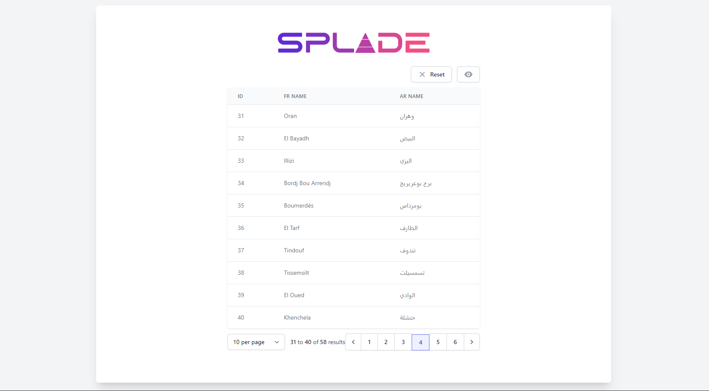

# Trying splade

## Setup steps

```bash
laravel new trying-splade
```

```bash
cd trying-splade
```

```bash
composer require protonemedia/laravel-splade
```

```bash
php artisan splade:install
```

```bash
npm install
```

Run dev servers:

```bash
npm run dev
```

```bash
php artisan serv
```

## Fast data with elaborate-code/laravel-algerian-provinces

```bash
composer require elaborate-code/laravel-algerian-provinces
```

## Basic table

```php
// routes\web.php

use ElaborateCode\AlgerianProvinces\Models\Wilaya;
use Illuminate\Support\Facades\Route;
use ProtoneMedia\Splade\SpladeTable;

Route::get('/', function () {

    $wilayas = Wilaya::paginate(10);

    return view('home')
        ->with(
            'wilayas',
            SpladeTable::for($wilayas)
                ->column('id')
                ->column('fr_name')
                ->column('ar_name')
        );
})
    ->middleware(['splade'])
    ->name('home');
```

```html
<!-- resources\views\home.blade.php -->

<x-layout>
    <x-slot name="header"> {{ __('Home') }} </x-slot>

    <x-panel class="flex flex-col items-center pt-16 pb-16">
        <x-application-logo class="block h-12 w-auto" />

        <div class="mt-8 text-2xl">
            <x-splade-table :for="$wilayas" />
        </div>
    </x-panel>
</x-layout>
```

### Results

On `http://127.0.0.1:8000/?page=4`


